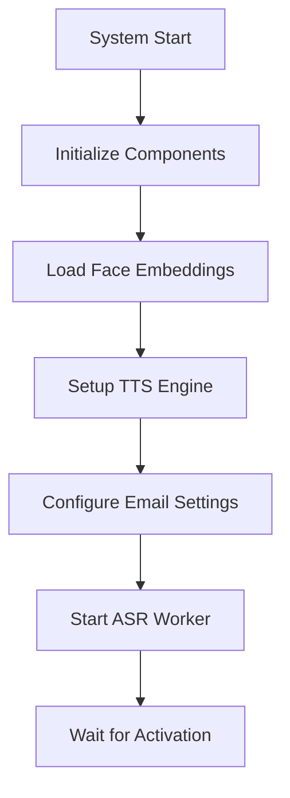
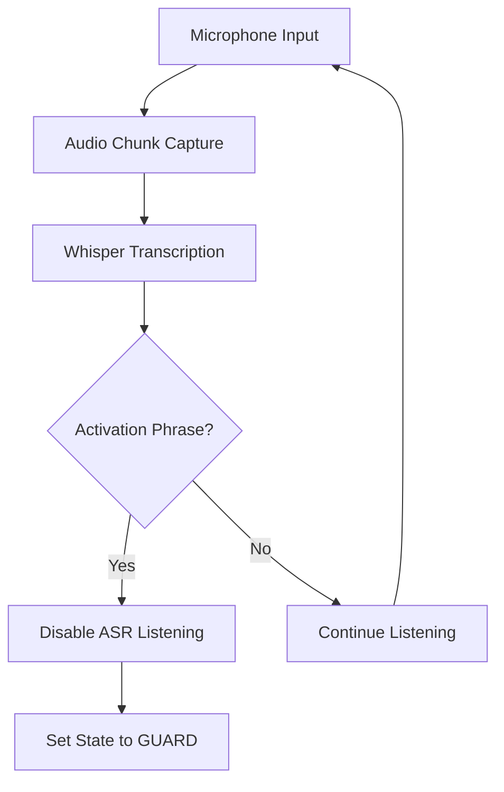
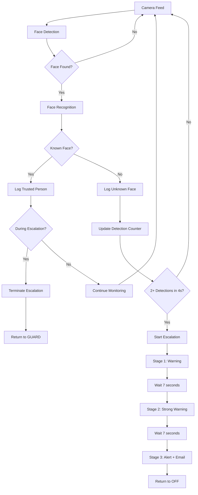

# 🤖 AI Room Guard System
---

## 📋 Table of Contents

- [✨ Features](#-features)
- [🏗️ System Architecture](#️-system-architecture)
- [🔄 System Flow](#-system-flow)
- [🚀 Installation](#-installation)
- [🎯 Usage Guide](#-usage-guide)
- [⚙️ Configuration](#️-configuration)
- [📊 System Behavior](#-system-behavior)
- [📁 Project Structure](#-project-structure)
- [🧪 Testing](#-testing)

---

## ✨ Features

### 🎤 **Voice Activation System**
- **Natural Language Processing**: Responds to conversational activation phrases
- **Multiple Phrase Support**: Recognizes various ways to start the system
- **Ambient Noise Adjustment**: Automatically calibrates to environment noise levels
- **Whisper Integration**: Uses OpenAI's Whisper for accurate speech recognition

### 👤 **Advanced Face Recognition**
- **Real-time Detection**: Continuous monitoring with 1-second intervals
- **Trusted Person Database**: Maintains local database of authorized individuals
- **Unknown Face Tracking**: Monitors and escalates on unauthorized access
- **Confidence Scoring**: Uses distance-based matching with configurable thresholds

### 📢 **3-Stage Escalation System**
- **Progressive Warnings**: Escalating severity of security responses
- **Time-based Transitions**: 7-second delays between escalation stages
- **Trusted Person Override**: Immediate de-escalation when authorized person detected
- **Automatic Reset**: Returns to OFF state after escalation completion

### 📧 **Email Notification System**
- **Instant Alerts**: Sends notifications during Level 3 escalation
- **Evidence Attachment**: Automatically includes intruder snapshots
- **Multiple Recipients**: Supports sending to multiple email addresses
- **SMTP Configuration**: Works with Gmail, Outlook, and other SMTP servers

### 📸 **Evidence Collection**
- **Automatic Snapshot Capture**: Takes photos during security incidents
- **Face Region Cropping**: Focuses on intruder's face with padding
- **Timestamped Storage**: Organizes evidence by date and time
- **Local Storage**: All evidence stored securely on local system

### 🔊 **Text-to-Speech Integration**
- **Natural Voice Output**: Female voice preference for announcements
- **Asynchronous Processing**: Non-blocking speech synthesis
- **Configurable Settings**: Adjustable speech rate and volume
- **Thread-safe Operation**: Multiple speech requests handled safely

---

## 🏗️ System Architecture

### **Core Components**

```
┌─────────────────────────────────────────────────────────────┐
│                    AI Room Guard System                     │
├─────────────────────────────────────────────────────────────┤
│                                                             │
│  ┌─────────────┐    ┌─────────────┐    ┌─────────────┐     │
│  │   Main.py   │◄──►│ StateManager│◄──►│ ASR Worker  │     │
│  │             │    │             │    │             │     │
│  └─────────────┘    └─────────────┘    └─────────────┘     │
│         │                   │                   │          │
│         ▼                   ▼                   ▼          │
│  ┌─────────────┐    ┌─────────────┐    ┌─────────────┐     │
│  │Face Recogn. │    │     TTS     │    │   Email     │     │
│  │             │    │             │    │ Notifier    │     │
│  └─────────────┘    └─────────────┘    └─────────────┘     │
│         │                   │                   │          │
│         ▼                   ▼                   ▼          │
│  ┌─────────────┐    ┌─────────────┐    ┌─────────────┐     │
│  │  Snapshot   │    │   Camera    │    │   Micro-    │     │
│  │  Capture    │    │   Feed      │    │   phone     │     │
│  └─────────────┘    └─────────────┘    └─────────────┘     │
│                                                             │
└─────────────────────────────────────────────────────────────┘
```

### **State Management**

```
┌─────────┐    Voice     ┌─────────┐    Face Rec.   ┌─────────┐
│   OFF   │ ──────────► │  GUARD  │ ────────────► │ INTERACT│
│         │  Activation │         │   Trusted     │         │
└─────────┘             └─────────┘   Person      └─────────┘
     ▲                       │                           │
     │                       ▼                           ▼
     │                  ┌─────────┐                ┌─────────┐
     │                  │  ALARM  │◄───────────────┤ ESCALAT.│
     │                  │         │  Unknown Face  │         │
     └──────────────────┘         └────────────────┘         └─────────┘
        Trusted Person              │                    │
        Detection                   ▼                    ▼
                                ┌─────────┐        ┌─────────┐
                                │ Email   │        │Snapshot │
                                │ Alert   │        │Capture  │
                                └─────────┘        └─────────┘
```

---

## 🔄 System Flow

### **1. System Initialization**



### **2. Voice Activation Flow**



### **3. Face Recognition & Escalation Flow**



### **4. Escalation Timeline**

```
Timeline: 0s ──────────────────────────────────────────────────► 24s

Stage 1:  [0s-1s]  Speak warning message
          [1s-8s]  Wait period (enable face recognition)
          [8s]     Transition to Stage 2

Stage 2:  [8s-9s]  Speak strong warning
          [9s-16s] Wait period (enable face recognition)
          [16s]    Transition to Stage 3

Stage 3:  [16s-17s] Speak final alert + Capture snapshot + Send email
          [17s-24s] Wait period
          [24s]     Return to OFF state

Trusted Person Detection (anytime): Immediate termination and restart
```

---

## 🚀 Installation

### **System Requirements**

| Component | Minimum | Recommended |
|-----------|---------|-------------|
| **Python** | 3.8+ | 3.9+ |
| **RAM** | 4GB | 8GB |
| **Storage** | 2GB | 5GB |
| **CPU** | Dual-core | Quad-core |
| **Camera** | USB 2.0 | USB 3.0 |
| **Microphone** | Built-in | External USB |

### **Platform-Specific Requirements**

#### **Windows**
```powershell
# Visual Studio Build Tools (for dlib compilation)
# OR use pre-compiled packages (recommended)
```

#### **Linux (Ubuntu/Debian)**
```bash
sudo apt update
sudo apt install python3-dev python3-pip cmake \
    libopenblas-dev liblapack-dev libx11-dev \
    libgtk-3-dev libboost-python-dev portaudio19-dev
```

#### **macOS**
```bash
brew install cmake boost-python3 portaudio
xcode-select --install
```

### **Quick Installation**

#### **Option 1: Automated Setup (Recommended)**

**Windows:**
```cmd
setup.bat
```

**Linux/macOS:**
```bash
chmod +x setup.sh
./setup.sh
```

**Cross-platform:**
```bash
python setup.py
```

#### **Option 2: Manual Installation**

```bash
# 1. Clone repository
git clone <repository-url>
cd ai-guard-agent

# 2. Create virtual environment
python -m venv ai_room_guard_env

# 3. Activate virtual environment
# Windows:
ai_room_guard_env\Scripts\activate
# Linux/macOS:
source ai_room_guard_env/bin/activate

# 4. Install dependencies
pip install --upgrade pip
pip install -r requirements.txt

# 5. Create directories
mkdir -p data/enrolled_faces data/logs/snapshots data/embeddings
```

### **Verification**

```bash
# Test camera
python src/main.py --camera-test

# Test direct guard mode
python src/main.py --direct-guard

# Test full system
python src/main.py
```

---

## 🎯 Usage Guide

### **Command Line Options**

```bash
# Basic usage
python src/main.py                    # Full system with voice activation
python src/main.py --camera-test      # Test camera only
python src/main.py --direct-guard     # Skip ASR, go directly to guard mode
```

### **Voice Commands**

The system recognizes these activation phrases (case-insensitive):

| Phrase | Example Usage |
|--------|---------------|
| `guard my room` | "Hey system, guard my room" |
| `guard the room` | "Please guard the room" |
| `guard this room` | "Guard this room now" |
| `start guard` | "Start guard" |
| `start guarding` | "Start guarding please" |
| `guarding my room` | "Begin guarding my room" |

### **System States**

| State | Description | Behavior |
|-------|-------------|----------|
| **OFF** | Initial state | Listens for activation phrases, no face recognition |
| **GUARD** | Active monitoring | Continuous face recognition, escalation on unknown faces |
| **INTERACT** | User interaction | (Reserved for future use) |
| **ALARM** | Security alert | (Legacy state, replaced by escalation system) |

### **Face Recognition Process**

1. **Enrollment**: Add photos to `data/enrolled_faces/`
2. **Embedding Generation**: System creates face encodings
3. **Recognition**: Real-time comparison against known faces
4. **Logging**: All detections logged with timestamps and locations

### **Escalation Behavior**

| Stage | Message | Duration | Face Recognition |
|-------|---------|----------|------------------|
| **1** | "Excuse me, I don't recognize you. Please identify yourself." | 8 seconds | Disabled during speech, enabled during wait |
| **2** | "You are not authorized to be here. Please leave immediately." | 8 seconds | Disabled during speech, enabled during wait |
| **3** | "ALERT. Intruder detected. Security and the room owner have been notified." | 8 seconds | Disabled during speech, enabled during wait |

---

## ⚙️ Configuration

### **Environment Variables (.env)**

Create a `.env` file in the project root:

```env
# Email Configuration
SMTP_SERVER=smtp.gmail.com
SMTP_PORT=587
SENDER_EMAIL=your-email@gmail.com
SENDER_PASSWORD=your-app-password
RECIPIENT_EMAILS=security@company.com,admin@company.com

# Face Recognition Settings
FACE_MATCH_THRESHOLD=0.6
WEBCAM_INDEX=0

# ASR Settings
WHISPER_MODEL=base.en
PHRASE_TIME_LIMIT=7
AMBIENT_ADJUST_SECONDS=3.0

# Escalation Settings
ESCALATION_WAIT_BETWEEN_LEVELS=7
```

### **Face Recognition Configuration**

#### **Enrollment Process**

1. **Add Photos**: Place clear, well-lit photos in `data/enrolled_faces/`
   ```
   data/enrolled_faces/
   ├── alice/
   │   ├── photo1.jpg
   │   ├── photo2.jpg
   │   └── photo3.jpg
   ├── bob/
   │   ├── photo1.jpg
   │   └── photo2.jpg
   └── charlie/
       ├── photo1.jpg
       ├── photo2.jpg
       ├── photo3.jpg
       └── photo4.jpg
   ```

2. **Generate Embeddings**: Run enrollment script
   ```bash
   python scripts/enroll_faces.py
   ```

3. **Verify Enrollment**: Check generated embeddings
   ```bash
   python scripts/test_recognition.py
   ```

#### **Recognition Settings**

| Parameter | Default | Description |
|-----------|---------|-------------|
| `FACE_MATCH_THRESHOLD` | 0.6 | Lower = stricter matching |
| `WEBCAM_INDEX` | 0 | Camera device index |
| Recognition Interval | 1.0s | Time between face checks |

### **Email Configuration**

#### **Gmail Setup**

1. **Enable 2-Factor Authentication**
2. **Generate App Password**
3. **Configure .env file**:
   ```env
   SMTP_SERVER=smtp.gmail.com
   SMTP_PORT=587
   SENDER_EMAIL=yourname@gmail.com
   SENDER_PASSWORD=your-16-char-app-password
   ```

#### **Other Email Providers**

| Provider | SMTP Server | Port | Security |
|----------|-------------|------|----------|
| **Outlook** | smtp-mail.outlook.com | 587 | STARTTLS |
| **Yahoo** | smtp.mail.yahoo.com | 587 | STARTTLS |
| **Custom** | your-smtp-server.com | 587/465 | STARTTLS/SSL |

### **TTS Configuration**

```python
# In src/tts.py
self.engine.setProperty('rate', 180)      # Speech rate (words/minute)
self.engine.setProperty('volume', 0.8)    # Volume (0.0-1.0)
self.engine.setProperty('voice', voice.id) # Voice selection
```

---

## 📊 System Behavior

### **Normal Operation Flow**

```
1. System Start
   ├── Load face embeddings
   ├── Initialize TTS engine
   ├── Start ASR worker
   └── Wait for activation phrase

2. Voice Activation
   ├── Detect activation phrase
   ├── Disable ASR listening
   └── Transition to GUARD state

3. Guard Mode
   ├── Start face recognition loop
   ├── Monitor camera feed (1-second intervals)
   ├── Log all face detections
   └── Track unknown face occurrences

4. Unknown Face Detection
   ├── Count detections in 4-second window
   ├── If 2+ detections: Start escalation
   └── If <2 detections: Continue monitoring

5. Escalation Process
   ├── Stage 1: Initial warning + 7s wait
   ├── Stage 2: Strong warning + 7s wait
   ├── Stage 3: Final alert + snapshot + email + 7s wait
   └── Return to OFF state

6. Trusted Person Override
   ├── Detect known face during escalation
   ├── Terminate escalation immediately
   ├── Speak termination message
   └── Restart system (return to OFF)
```

### **Error Handling**

| Error Type | Handling | Recovery |
|------------|----------|----------|
| **Camera Access** | Log error, continue without preview | Manual camera check |
| **Microphone Access** | Disable ASR, use direct-guard mode | Check audio permissions |
| **Face Recognition** | Continue with logging, skip processing | Restart recognition loop |
| **TTS Failure** | Log error, continue without speech | Restart TTS engine |
| **Email Failure** | Log error, continue without notification | Check SMTP configuration |
| **File System** | Create directories, log warnings | Automatic directory creation |

### **Performance Characteristics**

| Metric | Typical Value | Notes |
|--------|---------------|-------|
| **Face Recognition** | 1-2 FPS | Limited by 1-second intervals |
| **Memory Usage** | 200-500 MB | Depends on face database size |
| **CPU Usage** | 10-30% | Single-core intensive |
| **Startup Time** | 5-15 seconds | Includes model loading |
| **Response Time** | <1 second | From detection to action |

---


## 📁 Project Structure

```
ai-guard-agent/
├── 📁 src/                          # Source code
│   ├── 🐍 main.py                  # Main entry point and orchestration
│   ├── 🐍 face_recog.py            # Face recognition module
│   ├── 🐍 asr_worker.py            # Speech recognition worker
│   ├── 🐍 tts.py                   # Text-to-speech module
│   ├── 🐍 email_notifier.py        # Email notification system
│   ├── 🐍 snapshot_capture.py      # Photo capture utilities
│   ├── 🐍 state_manager.py         # System state management
│   └── 📁 utils/                   # Utility modules
│       ├── 🐍 config.py            # Configuration constants
│       └── 🐍 logger.py            # Logging utilities
├── 📁 data/                         # Data storage
│   ├── 📁 enrolled_faces/          # Trusted person photos
│   │   ├── 📁 alice/               # Person-specific folders
│   │   ├── 📁 bob/
│   │   └── 📁 charlie/
│   ├── 📁 logs/                    # System logs
│   │   └── 📄 ai_room_guard.log    # Main log file
│   ├── 📁 snapshots/               # Intruder photos
│   │   └── 📄 intruder_*.jpg       # Timestamped snapshots
│   └── 📁 embeddings/              # Face encoding storage
│       └── 📄 face_embeddings.pkl  # Pickled face encodings
├── 📁 scripts/                      # Utility scripts
│   ├── 🐍 enroll_faces.py          # Face enrollment script
│   ├── 🐍 test_recognition.py      # Recognition testing
│   └── 🐍 test_email.py            # Email configuration test
├── 📄 requirements.txt              # Python dependencies
├── 🐍 setup.py                     # Cross-platform setup script
├── 📄 setup.bat                    # Windows setup script
├── 📄 setup.sh                     # Unix setup script
├── 📄 INSTALLATION.md              # Detailed installation guide
├── 📄 README.md                    # This file
├── 📄 .env.example                 # Environment configuration template
└── 📄 .gitignore                   # Git ignore rules
```

### **File Descriptions**

| File | Purpose | Key Functions |
|------|---------|---------------|
| `main.py` | System orchestration | Main loop, escalation logic, state management |
| `face_recog.py` | Face recognition | Detection, recognition, embedding management |
| `asr_worker.py` | Speech recognition | Voice activation, Whisper integration |
| `tts.py` | Text-to-speech | Voice announcements, speech synthesis |
| `email_notifier.py` | Email alerts | SMTP communication, attachment handling |
| `snapshot_capture.py` | Photo capture | Evidence collection, image processing |
| `state_manager.py` | State management | System state transitions, callbacks |
| `config.py` | Configuration | System constants, file paths |
| `logger.py` | Logging | Colored console output, file logging |

---

## 🧪 Testing

### **Unit Tests**

```bash
# Run all tests
python -m pytest tests/

# Run specific test categories
python -m pytest tests/test_face_recognition.py
python -m pytest tests/test_asr.py
python -m pytest tests/test_escalation.py
```

### **Integration Tests**

```bash
# Test complete system flow
python tests/integration_test.py

# Test email functionality
python scripts/test_email.py

# Test face recognition accuracy
python scripts/test_recognition.py
```

### **Performance Tests**

```bash
# Benchmark face recognition
python tests/benchmark_recognition.py

# Memory usage test
python tests/memory_test.py

# CPU usage test
python tests/cpu_test.py
```

### **Manual Testing Checklist**

- [ ] **Camera Test**: `python src/main.py --camera-test`
- [ ] **Voice Activation**: Say activation phrases clearly
- [ ] **Face Recognition**: Test with known and unknown faces
- [ ] **Escalation Flow**: Verify 3-stage escalation timing
- [ ] **Email Notifications**: Check email delivery and attachments
- [ ] **Snapshot Capture**: Verify photo quality and storage
- [ ] **TTS Output**: Test voice announcements
- [ ] **System Restart**: Verify clean restart after escalation

---


